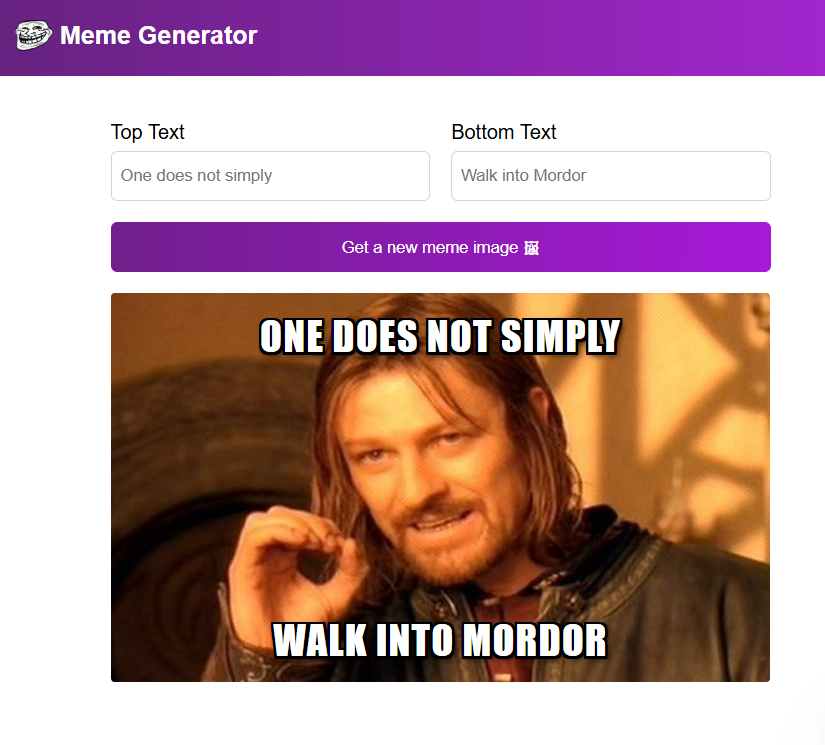

#  🎭 Meme Generator 

> A fun and interactive web app that lets users create custom memes instantly using random meme templates. 

---

## 🪞 Overview  
This Meme Generator allows users to generate memes by fetching random templates from the ImgFlip API and overlaying custom text on top of them. It's built for beginners learning React and JavaScript, and it makes practicing state, events, and API calls both engaging and enjoyable. The clean UI and dynamic content make the project simple yet exciting to use.
---

## 🚀 Features  
✨ Key things your app can do:  

- 🎯 Fetches real-time meme templates from the ImgFlip API  
- 🧠 Lets users enter top & bottom custom text  
- 📱 Random meme generator button
- 🌙 Simple, clean, and responsive UI

---

## 🧱 Tech Stack  
| Technology | Purpose |
|-----------|---------|
| **HTML5** | Base structure of the app |
| **CSS3** | Layout and styling |
| **JavaScript (ES6)** | Logic and functionality |
| **React (Vite)** | Component-based UI & state management |
| **ImgFlip API** | Source of meme templates |

---

## 📚 What We Have Studied  

Here are the key JavaScript concepts or tools covered while building this project 🧩   

- `useState` for managing component data  
- `useEffect` for fetching API data on mount  
- Controlled input fields for user text  
- Selecting random items from arrays  
- Splitting UI into reusable components  
- Working with external APIs in React  
- Positioning text over images using CSS

---

## 🌿 Lessons Learned  

> - How to manage state in React effectively  
> - How to perform API requests with `fetch`  
> - How to structure and organize components  
> - How to handle user inputs and update UI dynamically  
> - How to overlay text on images with CSS positioning  

---

## 🖼️ Screenshots / Demo  

  

🔗 **Live Demo:** [https://your-demo-link.vercel.app](https://your-demo-link.vercel.app)  

---

## 💫 Author  
👩‍💻 **Created by [Aliya](https://github.com/aliyasyeddd)**  
> _“Build. Break. Learn. Repeat.”_ 🌸  

---
